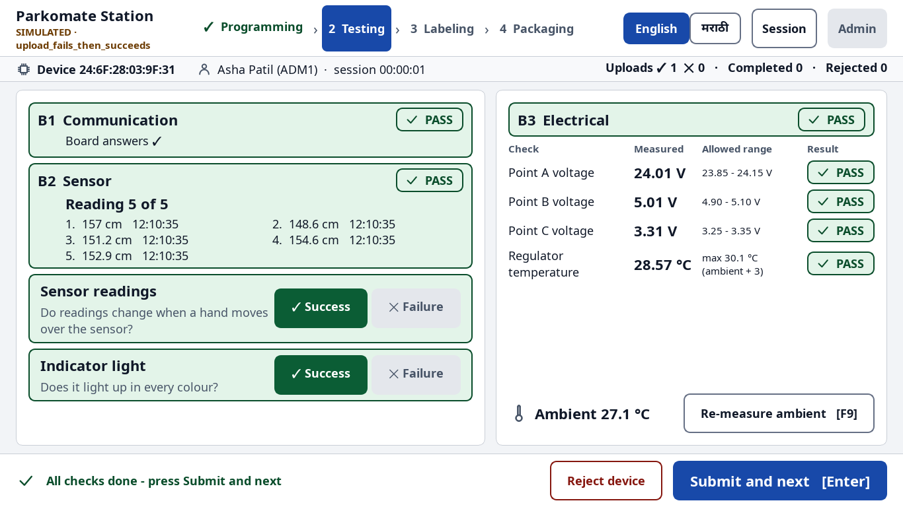

# Parkomate Station

Windows desktop application for the Parkomate production line. It takes one controller PCB
at a time through **A Programming → B Testing → C Labeling → D Packaging**, records every
result locally, rejects failing devices into the right box, and e-mails a report when the
session ends. English and Marathi.

> Status: backend (Prompt 1) and every screen (Prompt 2) are done and run on a **simulated
> bench** (mock hardware + a stub workflow). Real hardware and the final workflow arrive with
> the full build (Prompt 3).



## Setup

Requirements: Windows 10/11 (Linux/macOS work for development) and
[uv](https://docs.astral.sh/uv/). uv downloads Python 3.12 by itself.

```bash
cd parkomate-station
uv sync                       # creates .venv with all runtime + dev dependencies
uv run python -m parkomate admin create      # first administrator (asks for ID, name, password)
```

## Run

```bash
uv run python -m parkomate --mock            # station on the simulated bench
uv run python -m parkomate --mock --kiosk    # full screen, no window frame
uv run python -m parkomate --mock --scenario v_c_out_of_range
```

Data folder: `%PROGRAMDATA%\Parkomate` (Windows) or `~/.parkomate`. It holds `settings.toml`,
`parkomate.db`, `logs/`, `reports/`, `outbox/`, `backups/`. Use
`--data-dir <folder>` or `PARKOMATE_DATA_DIR=<folder>` for a scratch station.

A default `settings.toml` is written on first start; every key is documented in
[`config/settings.example.toml`](config/settings.example.toml). An invalid file stops the
station with a page naming each bad key.

### Mock scenarios

Choose with `--scenario`, `PARKOMATE_MOCK_SCENARIO` or `dev.mock_scenario`.
`PARKOMATE_MOCK_DELAY=0` makes the bench instant; `PARKOMATE_MOCK_SEED=7` repeatable.

| Scenario | What happens |
|---|---|
| `all_pass` | every board passes |
| `upload_fails_then_succeeds` | 1st flash fails, retry passes → "remove 1 failure?" prompt |
| `upload_always_fails` | rejected at A after the maximum attempts |
| `whitelist_denied` | server refuses the MAC → rejected at A |
| `com_disconnect_mid_flash` | cable "pulled" at 40 % → "Board not connected" steps → retry |
| `comm_fail` | board does not answer the communication test → rejected at B |
| `v_c_out_of_range` | Point C reads 3.21 V → rejected at B |
| `temp_too_high` | regulator 4.6 °C above ambient → rejected at B |
| `measurement_timeout` | 1st measurement times out → "Measure again" passes |
| `qr_unreadable` | 1st scan sees nothing → "Scan again" passes |
| `id_differs` | board holds a factory ID → QR ID written and confirmed |
| `id_write_fails` | read-back after writing differs → rejected at C |
| `camera_missing` | no camera → "Camera not found" steps |
| `mixed` | a random scenario per board (60 % pass) - realistic demo |

### Keyboard shortcuts

| Key | Action |
|---|---|
| **Enter** | the primary (blue, bottom-right) button; also "Device placed in box" and "Yes" on confirmations |
| **Space** | tick / untick the focused checklist row |
| **F1–F4** | tick checklist rows 1–4 (Labeling, Packaging) |
| **F5** | refresh serial ports (Programming, before connecting) |
| **F9** | re-measure ambient temperature |
| **Esc** | cancel a confirmation, close the session panel, leave the admin area - never deletes, rejects or logs out |
| **Tab** | move between controls (visible amber focus ring) |

## Command line

```bash
uv run python -m parkomate settings check            # validate settings.toml
uv run python -m parkomate secrets set smtp_password # store a secret in Windows Credential Manager
uv run python -m parkomate admin unlock OP12
uv run python -m parkomate admin reset-password OP12
uv run python -m parkomate outbox send               # send waiting report e-mails now
uv run python -m parkomate report 12 --format both --out C:\temp
```

## Tests and quality

```bash
uv run pytest                          # unit + integration + UI (pytest-qt, off-screen)
uv run pytest --cov=parkomate          # coverage (backend ≈ 97 %, whole package ≈ 91 %)
uv run pytest -m "not slow"            # skip the timing test
uv run ruff check src tests
uv run ruff format --check src tests
uv run mypy                            # strict, whole package
uv run python -m parkomate.ui.screenshots --out docs/screenshots   # 26 screens × EN/MR
```

## Documents

| File | For |
|---|---|
| [docs/OPERATOR_GUIDE.md](docs/OPERATOR_GUIDE.md) | bench operators (simple words, pictures) |
| [docs/ADMIN_GUIDE.md](docs/ADMIN_GUIDE.md) | supervisors: settings, operators, reports, e-mail |
| [docs/screenshots/](docs/screenshots/) | every screen in English (`en_*`) and Marathi (`mr_*`) |
| [CONTRACTS.md](CONTRACTS.md) | interfaces for Aditya (hardware) and Piyush (workflow) |
| [DECISIONS.md](DECISIONS.md) | every assumption, contract changes, open client questions |
| [CLAUDE.md](CLAUDE.md) | project memory and rules for Claude Code |
| [src/parkomate/i18n/REVIEW.md](src/parkomate/i18n/REVIEW.md) | Marathi texts to be checked by a native speaker |

## Layout

```
src/parkomate/
  core/         shared models, enums, errors, event bus, contracts (interfaces.py)
  config/       settings (pydantic + TOML), secrets (keyring)
  data/         SQLite, migrations/, repositories/, records.py (production API), recovery.py
  auth/         operators, Argon2 passwords, lockout, roles
  reports/      layout.py (THE report layout), Excel/CSV writers, exporter
  mail/         SMTP + OAuth2 mailers, outbox with retry, session reporter
  i18n/         en.json, mr.json, t()/tr()
  hardware/     mocks/ (Aditya replaces with the real service)
  workflow/     stub/ (Piyush replaces with the real state machine)
  ui/           theme/, components/, viewmodels/, views/, workers/, screenshots.py
  station.py    login / logout / start-up facade      app.py   composition root
tests/          unit/, integration/, ui/
```
