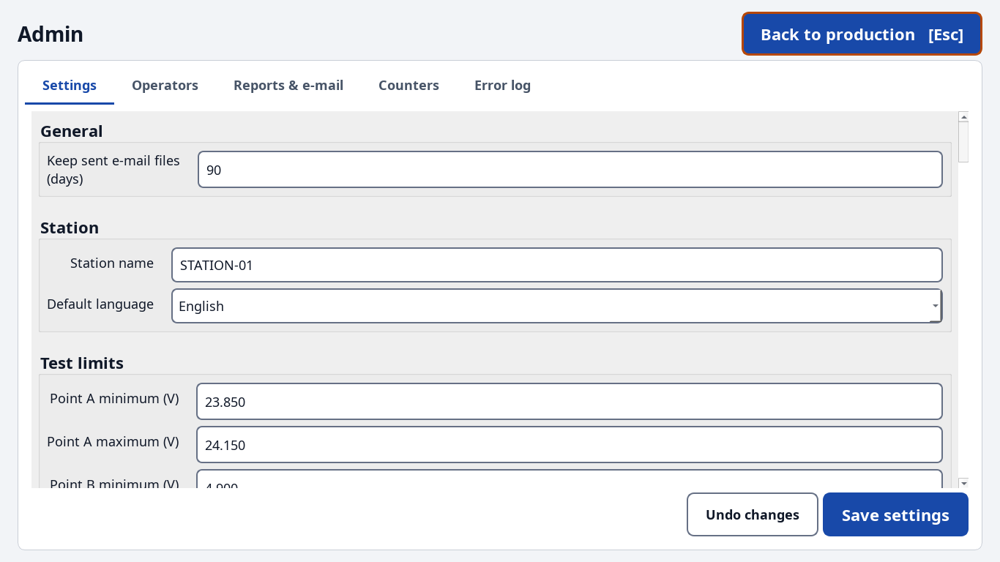
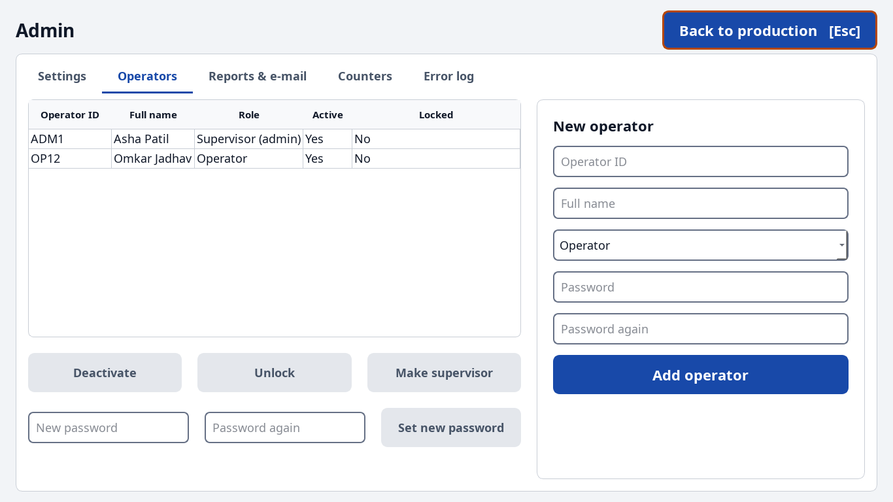
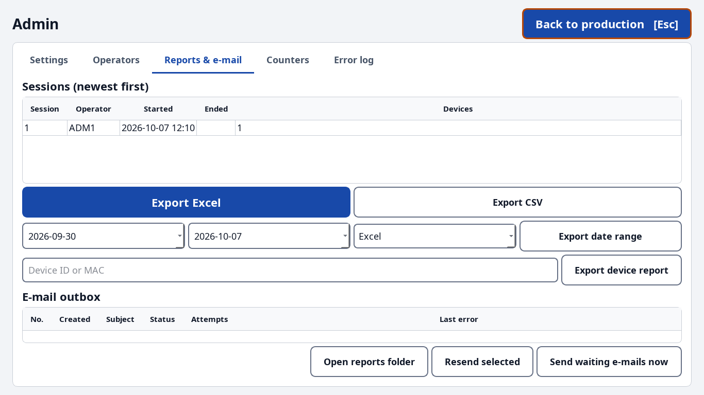

# Admin guide - Parkomate Station

For supervisors / administrators. Operators use the [operator guide](OPERATOR_GUIDE.md).

## 1. Install and first start

1. Install the station (installer arrives with the full build; today: `uv sync`, see README).
2. Create the first administrator **once**, in a command window on the bench PC:
   ```
   python -m parkomate admin create
   ```
   (asks for operator ID, full name, password twice). Refused if an admin already exists.
3. Start the station, log in with that admin, open **Admin** (top right) and add operators.

Data folder: `C:\ProgramData\Parkomate`

| Item | What |
|---|---|
| `settings.toml` | station settings (edit in **Admin → Settings**) |
| `parkomate.db` | all production data (SQLite) - back it up with the PC backup |
| `reports\` | Excel / CSV report of every session |
| `outbox\` | e-mails waiting to be sent (`.eml`), kept after sending for `retention_days` |
| `logs\app.log`, `logs\errors.jsonl` | logs; errors are also visible in **Admin → Error log** |
| `backups\` | automatic database copy before a software update changes the database |

Windows users of the bench PC need **modify** rights on this folder (the installer sets it).

## 2. Admin area

Open **Admin** (top right). It is only available to supervisors and only when no board is in
progress. **Back to production** (or **Esc**) returns.



### Settings
* Every field is checked when you press **Save settings**; a wrong field turns red with the
  reason under it, and nothing is saved until all are valid.
* Each saved change is written to the audit log (who, when, old → new value).
* **Test limits** are inclusive (`minimum ≤ value ≤ maximum`), compared after rounding to
  *Decimals used for comparison* (default 2).
* **Passwords and tokens** never go into the settings file. Use the *Passwords and tokens*
  box: pick the entry (SMTP password, OAuth token, API token), type the value, **Store in
  Credential Manager**. Or on the command line: `python -m parkomate secrets set smtp_password`.
* Settings saved here lose the comments of the file; every key is documented in
  `config/settings.example.toml`.

### Operators


* **Add operator**: ID (letters, digits, `- _ .`), full name, role, password twice
  (minimum length in *Login security*).
* Select a row to **Deactivate / Activate**, **Unlock** (after 5 wrong passwords),
  **Make supervisor / Make operator**, or **Set new password**.
* The last active supervisor cannot be deactivated or demoted.
* Forgot the only admin password? `python -m parkomate admin reset-password <ID>`.

### Reports & e-mail


* Select sessions → **Export Excel** / **Export CSV**, or a date range → **Export date range**.
* Type a device ID or MAC → **Export device report** (one board, every check).
* Sheets: **Summary** (one column per session), **Devices** (one row per board, every check
  value + PASS/FAIL + limits), **Checks** (every single result, including each upload
  attempt), **Rejections** (stage, box, check, value, limits, reason).
* **E-mail outbox**: each session report is queued first, then sent. Failures are retried
  automatically (1 min, 2 min, 4 min … max 1 h; at start-up and every 5 minutes). After
  *Give up after attempts* the status becomes **Failed** - fix the e-mail settings and press
  **Resend selected**. **Send waiting e-mails now** forces a try.

### E-mail set-up
In *Report e-mail*: switch on, recipients (comma separated), sender, SMTP server and port.
* Microsoft 365: `smtp.office365.com`, port 587, `starttls`. Microsoft switches off password
  (basic) SMTP sign-in by default from **end of December 2026** - plan `oauth2` (see
  DECISIONS M6; token set-up comes with the full build).
* Gmail: `smtp.gmail.com`, 587, `starttls`, an app password.
* Internal relay without sign-in: security `none` (the password is then never sent).

### Counters
Live counters of the current session. **Reset counters** restarts them from zero after a
confirmation; the history and the session report still contain everything. Audited.

### Error log
Last 200 errors, newest first, filter by error code, click a row for details (no passwords
or firmware are ever logged).

## 3. Things to know

* **Remove 1 failure**: after a failed upload and a successful retry the operator may remove
  that one failure from the count - once per board, recorded in the audit log.
* **Crash / power cut**: at the next start the unfinished board is marked *abandoned*, the
  session is closed and its report queued; the login screen tells the operator.
* **Only one station window** can run per PC.
* **Simulated bench**: the top-left shows `SIMULATED · <scenario>` while mock hardware is in
  use (`dev.use_mock_hardware`). Never use it for real production.
