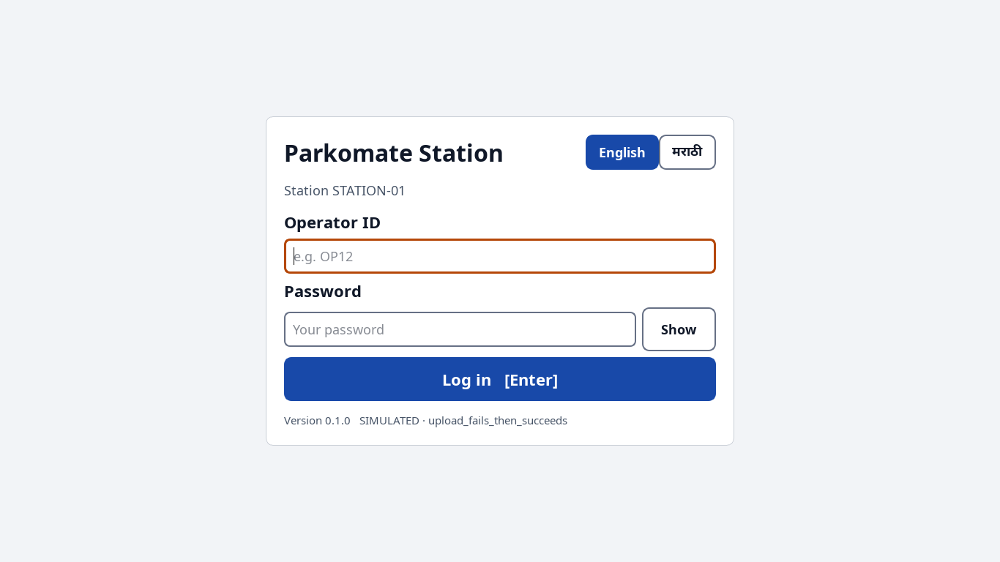
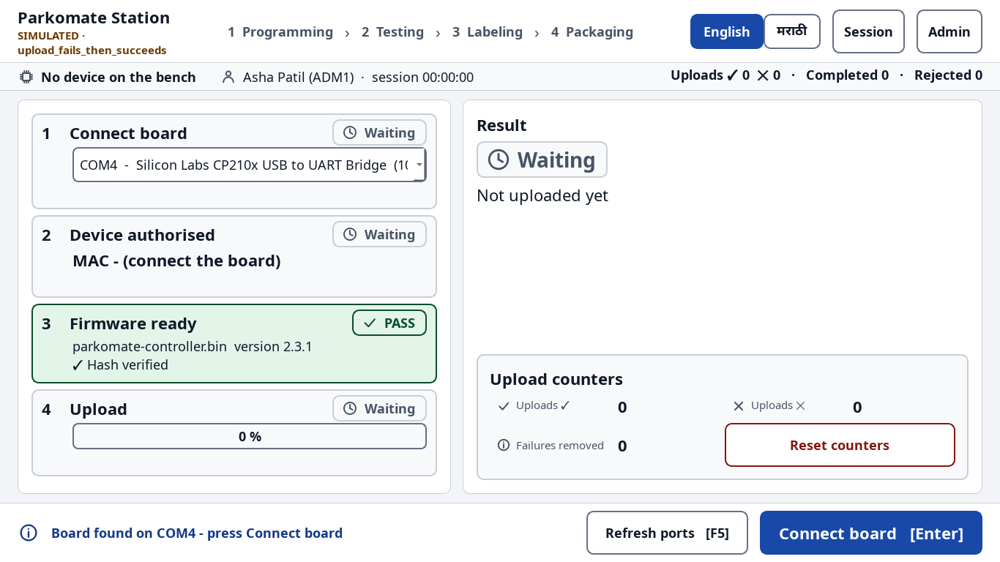
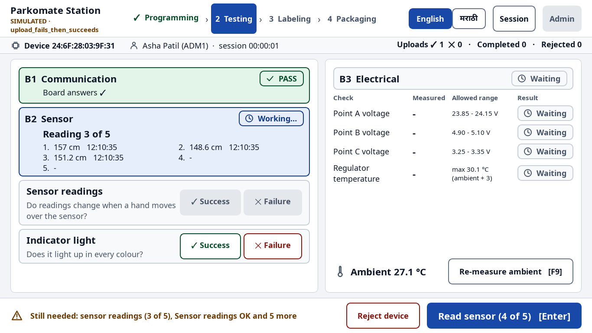
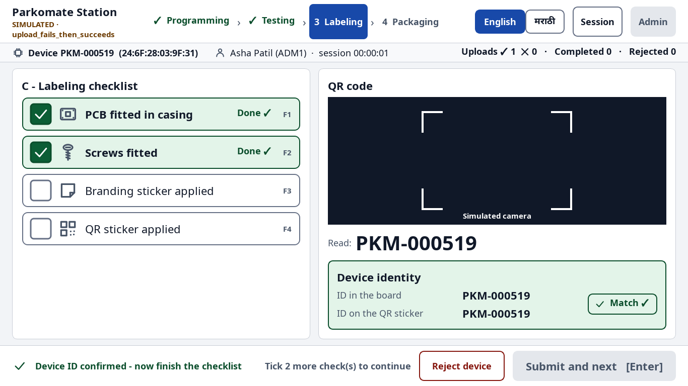
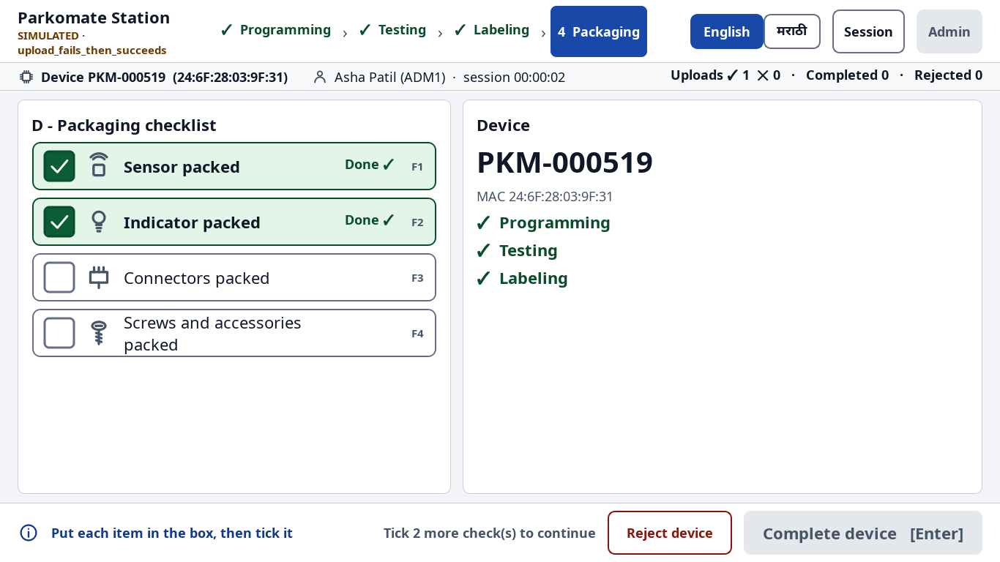
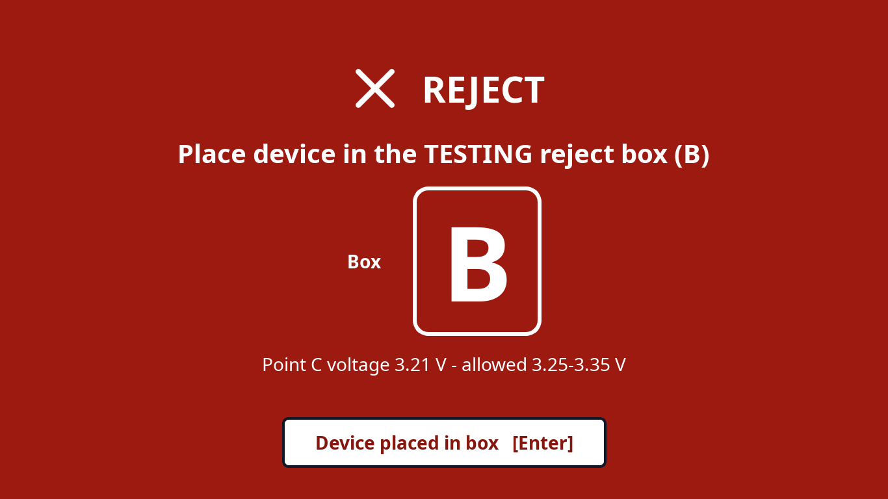
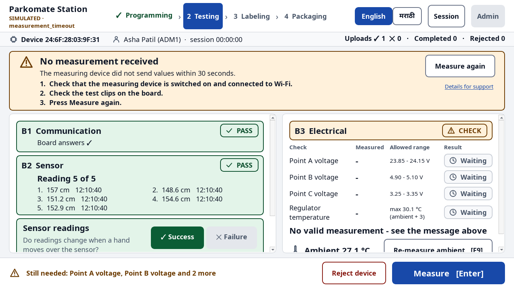

# Operator guide - Parkomate Station

One board at a time. Follow the screen. **The big blue button at the bottom-right is always
the next thing to do** - press it or press **Enter**.

The screen is also in Marathi: press **मराठी** at the top. The app remembers your choice.

---

## 1. Log in

1. Type your **Operator ID** and **Password**. Press **Enter**.
2. Wrong password 5 times → the account is locked for a few minutes. The screen tells you how
   long. Your supervisor can unlock it.
3. The station measures the room temperature. Wait for the ✓.

## 2. The screen

* **Top**: the four stages. The blue one is where you are. ✓ = done.
* **Line below**: the board (MAC or ID), your name, session time, counters.
* **Middle left**: the steps. **Middle right**: the results.
* **Bottom**: what is still needed, and the **blue button** (next action).
* A grey button says **why** it is not ready yet (for example "Tick all 4 checks").

## 3. A - Programming

1. Plug the board's USB cable. The port is chosen for you.
2. Press **Connect board** (Enter). The station checks the board with the server.
3. Press **Upload firmware** (Enter). Keep the cable in until 100 %.
4. If the upload fails, press **Retry upload**. If it then works, the station asks
   **"Remove 1 failure from count?"** - answer once.
5. Press **Submit and next**.

## 4. B - Testing

1. The communication test runs by itself.
2. Press **Read sensor** 5 times (Enter each time).
3. Look at the board: do the readings change? Does the indicator light up?
   Press **✓ Success** or **✕ Failure** for each.
4. The electrical measurement starts by itself. Every line must show **✓ PASS**.
5. Press **Submit and next**.

## 5. C - Labeling

1. Hold the QR sticker in the frame. The ID is read and set in the board by itself.
2. Do the 4 jobs and tick each row (click the row, or **F1 F2 F3 F4**).
3. Press **Submit and next**.

## 6. D - Packaging

1. Put each item in the box and tick it (**F1–F4**).
2. Press **Complete device**. A green bar says **"Device … complete"**.
3. Unplug the board, plug the next one, press **Connect board**.

## 7. RED screen = reject

1. Read the box letter (**A**, **B**, **C** or **D**).
2. Put the board in **that reject box**.
3. Press **Device placed in box** (Enter).

## 8. Something went wrong

Do the numbered steps, then press the button on the right (**Try again**, **Measure again**,
**Scan again** …). If it keeps happening, call the supervisor and show the screen.

## 9. End of shift

1. Press **Session** (top right) → **End session** → **End session** again to confirm.
2. The summary shows your counts. The report is sent (or saved and sent later).
3. Press **Log out**.

**Esc** never deletes anything. If the station closes by accident, the board on the bench is
marked "not finished" - put it aside for re-testing and tell the supervisor.
